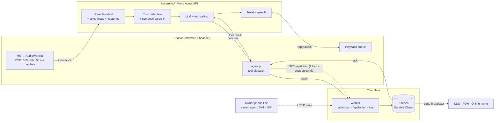
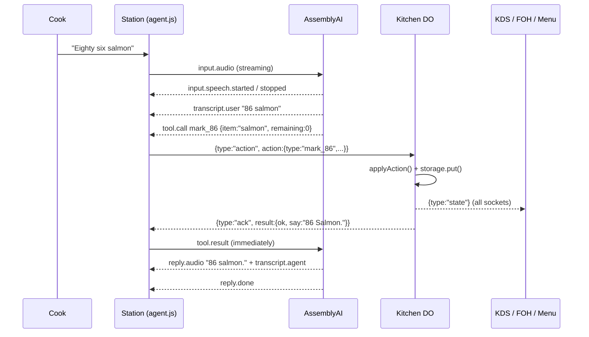

# Architecture

## Overview

## A single command, end to end ("86 salmon")

The screens update when the Durable Object broadcasts, before the agent even speaks its confirmation. The spoken reply is only a confirmation; the UI doesn't wait for it.

## Components

### Station (`public/station.html`, `public/js/agent.js`, `public/js/audio.js`)
- **Auth + config:** `GET /api/token` makes the Worker mint a short-lived AssemblyAI token (300 s to connect, sessions up to 3 h) and return the station's full session config, built by `src/session.js` from `agent/prompt.md`, `agent/station.json` and `data/menu.json`. The API key never reaches the browser.
- **Session:** the first message is `session.update { session }` with the config inline: prompt, 10 client tools, keyterms, voice focus and voice. The docs require client-side tools to be declared inline, and `agent_id` can't be combined with inline fields, so the station doesn't use a stored agent.
- **Voice focus:** accepted inline (verified live). If a session ever rejects `input.voice_focus`, the station logs it and reconnects once without it (`/api/token?voice_focus=0`).
- **`transcription_mode: "min_latency"`:** in live A/B tests it was 0.6–1 s faster from end of speech to action than `balanced`, with the same accuracy.
- **Audio in:** a 24 kHz `AudioContext` and an `AudioWorklet` produce 960-sample (40 ms) PCM16 chunks, batched 2× into 80 ms `input.audio` messages, base64-encoded. The browser's own echo cancellation, noise suppression and gain control run first, then AssemblyAI's voice focus.
- **Audio out:** each `reply.audio` chunk is decoded and scheduled back to back (gapless). On barge-in, `input.speech.started` stops and clears everything already scheduled; the final `transcript.agent` arrives with `interrupted: true` so the transcript shows where the reply was cut.
- **Client tools:** `tool.call` becomes a Durable Object action, and the DO's result becomes the `tool.result`.
- **Result timing:** the docs suggest sending `tool.result` only once `reply.done` is the latest turn event, because the agent may be speaking a transition phrase. Live timelines showed that transition reply is **silent**: the service streams ~2 s of silence after `tool.call` before `reply.done`, so waiting only delayed every spoken confirmation. The station sends `tool.result` as soon as the tool finishes — verified live with no errors and ~2 s faster confirmations.
- **Silent-reply gate:** on chatter, the model sometimes "says nothing" by emitting an invisible character (`\uFEFF`, `&nbsp;`), and the TTS still voices it (seen in live recordings). The station holds each reply's audio until a `transcript.agent.delta` with letters or digits arrives; if none does before `reply.done`, the buffered audio is dropped. When real words arrive, the buffer plays immediately. The cost is about 0.25 s on real replies, which start with ~0.3 s of leading silence anyway.
- **Push-to-talk:** while off-air, silence (zeroed PCM) is streamed instead of mic audio, so turn detection keeps its timing.
- **Proactive alerts:** a DO `alert` triggers `reply.create { instructions }`, but only while the station is idle. Otherwise it retries every 2.5 s (up to 12 times) until the agent's transcript confirms the alert was spoken.
- **Resilience:** if the socket closes, the station reconnects with a fresh token and sends `session.resume` within the 30 s grace window (conversation context is kept). If the resume is refused, or the window has passed, it starts a new session.

### Screens (`public/*.html`, `public/js/chrome.js`, `public/js/board.js`)
Static HTML with no build step. Every screen (and the landing page) shares two modules:
- **`connectBoard({ onState, onAlert, onStatus })`** — one Durable Object WebSocket per screen, auto-reconnecting with exponential backoff, plus `act(action) → Promise<Result>` (5 s timeout, queued while the socket is down).
- **`mountChrome({ active, title, outs })`** — the header (brand, live/reconnecting status, nav, clock) and, where it matters, the 86 strip. Screens call `chrome.setStatus()` from `onStatus` and `chrome.setOuts(state)` from `onState`.

Per screen:
- **Station** — the mic and the typed command line run the *same* instant grammar (`public/js/intent.js`), so a command lands even with no microphone and no AssemblyAI key (void confirmations are tracked separately from the voice lane's). Latency stats and the sparkline are read off `ack` lines; push-to-talk and volume persist in `localStorage`.
- **KDS** — tickets with mm:ss ages that go green → amber (5 min) → red (10 min, the same threshold as `ALERT_AFTER_MS`) with a progress bar to the alert, `Fire / Hold / Bump` per ticket with a 5 s **Undo** toast (`reopen_ticket`), All / Fired / Late filters, service KPIs and an all-day tally. Ages tick in place every second instead of re-rendering the board, so a tap is never lost.
- **Front of house** — search and category filters, stock bars with a low-stock state, and a kitchen feed colour-coded by entry type.
- **Online menu** — quantity steppers capped by stock, an itemised cart, a sold-out banner, and anything that sells out while sitting in a cart is removed with a toast.

### Worker (`src/worker.js`)
| Route | Purpose |
|---|---|
| `GET /ws` | Upgrades to the Kitchen DO WebSocket |
| `GET /api/token` | Mints an AssemblyAI temporary token; returns it with `wsUrl` and the inline `session` config |
| `GET /api/tools/inventory` | HTTP tool (owner phone agent) |
| `GET /api/tools/report` | HTTP tool (owner phone agent) |
| `GET /api/health` | Shows whether the API key and tool secret are configured |
| everything else | Static assets from `public/` |

HTTP tools require the `x-tool-secret` header. The value is stored encrypted on the AssemblyAI agent and never returned by their API.

### Kitchen Durable Object (`src/kitchen.js`)
- One instance (`idFromName('main')`) per restaurant, holding the authoritative state and persisting it to DO storage on every change.
- **Hibernatable WebSockets** (`ctx.acceptWebSocket`): idle screens cost nothing, and the state is reloaded from storage when the object wakes up.
- `act(action)` is shared by the WebSocket path and the HTTP-tool RPC path.
- **Alarm:** while any fired ticket hasn't been announced, an alarm runs every 15 s and broadcasts `alert` for fired tickets older than 10 minutes, once per ticket.

### Reducer (`src/state.js`)
- `applyAction(state, action, now)` is pure: it never mutates its input, and when an action fails it returns the same state object unchanged.
- The same code runs in the DO, the unit tests and the eval harness, so eval results reflect production logic.
- **Item matching:** exact name/id → alias → substring → edit distance (≤1 for short words, ≤2 for longer). Ambiguous or unknown items return `unknown_item`, and the prompt tells the agent to ask "Which item?" instead of guessing.
- **Safety:** `void_ticket` fails with `needs_confirmation` unless `confirmed: true`, so a misheard "void" can't cancel a ticket.
- **Online orders** use up stock and automatically 86 an item when it hits zero. Orders for sold-out items are rejected.

## Design decisions
| Decision | Why |
|---|---|
| Browser connects straight to AssemblyAI | Audio has no extra hop; latency is AssemblyAI's pipeline plus the network |
| Station: inline session config | The documented way to use client-side tools; config lives in git and changes apply on the next session, with nothing to sync |
| Owner line: stored agent with HTTP tools | A phone call has no browser to run tools, so AssemblyAI calls the Worker; the header secret is stored encrypted on the agent |
| Station tools are all client-side | They update the UI instantly and work on localhost with no public endpoint |
| ≤ 10 tools per agent | AssemblyAI's guidance: tool-selection accuracy drops above that |
| Menu `enum` on item parameters + keyterms | Two layers of accuracy: keyterms bias transcription toward menu words, and the enum restricts what the LLM can output |
| Durable Object instead of a database | Holds state and fans out in real time in one place; no extra service |
| In-memory + DO storage, single restaurant | `ponytail:` enough for the demo. Multi-tenant = one DO per restaurant id |
| Replies of 1–5 words | A kitchen can't take chatty audio; short replies also reduce time to first audio |
| Managed LLM (no BYO) | BYO LLM is only allowed on stored agents, and on this account the only gateway model available has no tool support. The managed model got every tested command right |
| Chatter → silence (prompt) + push-to-talk fallback | Continuous listening in a loud kitchen is the biggest false-trigger risk |

## Latency budget (measure with `npm run eval`; live breakdown in docs/SUBMISSION.md)
| Segment | Target |
|---|---|
| End of speech → turn detected | set by AssemblyAI turn detection |
| Turn → `tool.call` | LLM tool selection |
| `tool.call` → DO ack → screens updated | < 100 ms (edge round trip) |
| **End of speech → screens updated** | **< 1.5 s** |

The station shows the live median as "median speech→action", measured from `input.speech.stopped` to the DO ack.

## Limits and next steps
- **One restaurant per deployment.** Next step: key the DO by restaurant id and add auth.
- **Stations aren't told apart.** Every station gets every alert. Next step: a station id in the alert and the session.
- **Mock POS.** Next step: Toast / Square inventory APIs behind the same `act()` interface.
